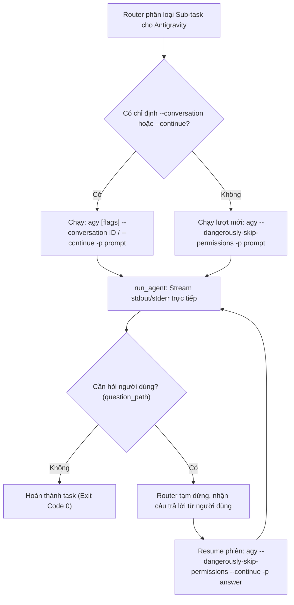

# Báo Cáo Tiến Độ & Kỹ Thuật: Tích Hợp Cơ Chế Resume Cho Antigravity CLI

> **Tài liệu tham khảo kỹ thuật**  
> **Dự án:** `phapit/agent-skills` (Skill: `ai-task-router`)  
> **Ngày cập nhật:** 23/09/2026  
> **Tác giả:** Antigravity AI Assistant  

---

## 1. Bối cảnh & Vấn đề Cần Giải Quyết

Trước đây, trong hệ thống điều phối đa Agent (`ai-task-router`), Antigravity CLI (`agy`) được quản lý thông qua một tiến trình TUI tương tác chạy ngầm trong `tmux`:
- Router phải tạo một phiên tmux riêng biệt (`ai_router_agy_<project>`).
- Lệnh được gửi qua `tmux send-keys`.
- Trạng thái hoàn thành được xác định bằng cách đọc liên tục màn hình terminal (`tmux capture-pane`) mỗi 2 giây và đếm chuỗi marker `Đã hoàn tất task. [id:...]`.
- **Hạn chế:**
  - Bắt buộc môi trường phải cài đặt sẵn `tmux`.
  - Cơ chế đếm marker dễ gặp lỗi lệch bộ đếm hoặc timeout giả (1800 giây).
  - Không thu thập được mã thoát (exit code) thực tế của tiến trình.
  - Phức tạp hóa mã nguồn với hơn 140 dòng logic quản lý terminal tmux.

---

## 2. Phát Hiện Kỹ Thuật (Technical Discovery)

Qua điều tra chính thức từ Antigravity CLI (`agy --help`), `agy` hỗ trợ 2 tham số khôi phục phiên hội thoại:
1. `--continue` (hoặc alias ngắn `-c`): Tiếp tục phiên hội thoại gần nhất trong workspace hiện tại.
2. `--conversation <ID>`: Khôi phục chính xác một phiên hội thoại trước đó theo Conversation ID cụ thể.

Khi kết hợp với:
- `-p` (`--print`): Chạy một prompt ở chế độ không tương tác (print mode) và trả về stdout/stderr cùng mã thoát (exit code) chuẩn.
- `--dangerously-skip-permissions`: Tự động phê duyệt các quyền truy cập tệp/công cụ trong môi trường print mode mà không làm gián đoạn tiến trình.

---

## 3. Kiến Trúc Sau Nâng Cấp

### Các cải tiến chi tiết:

1. **Thay thế hoàn toàn tmux trong router bằng CLI trực tiếp (`run_antigravity_agent`):**
   - Loại bỏ các hàm phụ thuộc tmux trong `classify_and_split_task.py`: `ensure_agy_session`, `tmux_capture`, `tmux_send_task`, `wait_pane_stable`, `parse_agy_context_tokens`, `check_and_compact_agy_context`.
   - Giảm hơn 140 dòng mã thừa, tăng tính ổn định và tốc độ phản hồi.

2. **Duy trì ngữ cảnh tương tác người dùng qua Resume:**
   - Khi Antigravity gặp quyết định kiến trúc hoặc câu hỏi cần người dùng làm rõ, agent ghi vào `question_path` và thoát lượt hiện tại.
   - Router hiển thị câu hỏi, nhận phản hồi và kích hoạt tiếp lượt sau bằng `agy --dangerously-skip-permissions --continue -p <answer>` (hoặc giữ nguyên `--conversation <ID>`).

3. **Bổ sung các cờ CLI mới cho Router:**
   - `--agy-continue`: Tiếp tục phiên làm việc gần nhất của Antigravity (`agy --continue`).
   - `--agy-conversation <ID>`: Khôi phục phiên làm việc theo Conversation ID (`agy --conversation <ID>`).

4. **Đồng bộ tham số Workspace (`cwd`):**
   - Bổ sung tham số `cwd` vào `run_agent`, đảm bảo `run_claude_agent`, `run_codex_agent` và `run_antigravity_agent` luôn được thực thi chính xác trong thư mục làm việc đích.

5. **Cập nhật tài liệu song ngữ:**
   - Cập nhật [README.md](file:///mnt/ProjectsAndData/Github/ai_router/ai-task-router/README.md) và [README.en.md](file:///mnt/ProjectsAndData/Github/ai_router/ai-task-router/README.en.md) để phản ánh kiến trúc mới.

---

## 4. Kết Quả Kiểm Thử & Nghiệm Thu

| Hạng mục kiểm thử | Lệnh thực thi | Kết quả | Trạng thái |
| :--- | :--- | :--- | :--- |
| **Cú pháp Python** | `python3 -m py_compile ai-task-router/classify_and_split_task.py` | Không phát sinh lỗi cú pháp | **PASS** |
| **CLI Help Options** | `python3 ai-task-router/classify_and_split_task.py --help` | Hiển thị đầy đủ `--agy-continue`, `--agy-conversation` | **PASS** |
| **Quota & Model Status** | `python3 ai-task-router/classify_and_split_task.py --check-quota` | Đọc quota Antigravity (94%), Codex (0.155.1) ổn định | **PASS** |
| **Git Diff Review** | `git diff --stat` | -142 dòng dư thừa, +77 dòng chuẩn hóa | **PASS** |

---

## 5. Trạng Thái Triển Khai Git

- **Remote chính (`origin`):** `git@github.com:phapit/agent-skills.git` (Đã push commit `c0a6379`).
- **Remote phụ (`backup`):** `git@github.com:phapit/agent-skills-backup.git` (Được cấu hình để đồng bộ toàn bộ tiến độ).
