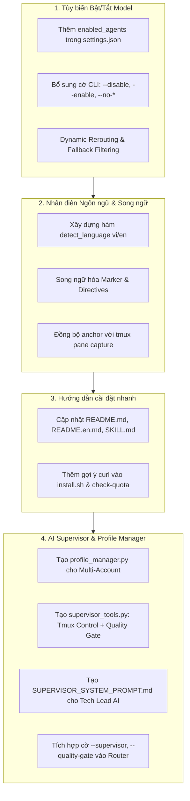

# Kế Hoạch & Báo Cáo Kỹ Thuật: Nâng Cấp Hệ Thống AI Task Router & Kiến Trúc AI Supervisor

> **Tài liệu tham khảo dành cho AI Agent & Kỹ sư phát triển**  
> **Dự án:** `phapit/agent-skills` (Skill: `ai-task-router`)  
> **Ngày cập nhật:** 23/09/2026  
> **Tác giả:** Antigravity AI Assistant

---

## 1. Bối cảnh & Yêu cầu Nhiệm vụ

Hệ thống `ai-task-router` ban đầu được xây dựng để điều phối công việc giữa 3 AI Coding Agent CLI:
- **Antigravity (`agy`)**: Frontend, UI, file scanning, ops cơ bản.
- **Codex (`codex`)**: Code generation tốc độ cao, viết unit tests, migration script, thuật toán.
- **Claude Code (`claude`)**: Suy luận nghiệp vụ, kiến trúc hệ thống, backend phức tạp, handoff docs.

Trong phiên làm việc này, người dùng đã đặt ra 4 yêu cầu nâng cấp lớn:

1. **Khả năng Bật / Tắt Model AI tùy ý:**
   - Cho phép người dùng tắt bất kỳ model nào trong 3 model (do hết quota, chưa cài CLI, hoặc nhu cầu cá nhân).
   - Khi một model bị tắt, router phải tự động điều phối lại sub-task sang model thay thế tốt nhất và loại model đã tắt khỏi chuỗi fallback.
2. **Tự động nhận diện ngôn ngữ cho câu hoàn tất Task:**
   - Thay vì luôn in ra câu cứng nhắc `Đã hoàn tất task.`, router cần nhận diện ngôn ngữ prompt của người dùng.
   - Nếu là Tiếng Việt: Sử dụng `Đã hoàn tất task. [id:...]`.
   - Nếu là Tiếng Anh hoặc ngôn ngữ khác: Sử dụng câu tiếng Anh chuẩn chuyên nghiệp `Task completed. [id:...]`.
   - Đồng bộ câu marker này với chỉ dẫn prompt của Agent và bộ đếm pane trong session `tmux` của Antigravity.
3. **Bổ sung hướng dẫn cài đặt nhanh 3 CLI trên Linux & macOS:**
   - Cung cấp các lệnh `curl` one-liner chính thức cho `agy`, `claude`, và `codex`.
4. **Kiến trúc AI Supervisor (Kết hợp Phương án A + C) & Multi-Account Profile:**
   - Thay thế việc kiểm soát terminal bằng hardcoded Python script (dễ kẹt, dễ sai sót).
   - Cho phép chạy 2 tài khoản Antigravity (hoặc Claude, Codex) độc lập qua tmux bằng cơ chế cách ly profile `$HOME`.
   - Cho phép người dùng tùy ý chọn một Model AI làm **Supervisor (Tech Lead)**:
     - **Phương án A (Terminal Control):** Quan sát terminal tmux của worker, gửi phím bấm xử lý khi có prompt `[y/N]`.
     - **Phương án C (Quality Gate):** Nghiệm thu độc lập sau khi worker hoàn tất bằng cách kiểm tra `git diff` và tự chạy test suite.

---

## 2. Kế hoạch Triển khai (Execution Plan)



---

## 3. Chi tiết Kỹ thuật đã Thực hiện

### 3.1. Tùy chọn Bật / Tắt Model AI
- **File sửa đổi:** [`ai-task-router/classify_and_split_task.py`](file:///Users/phap/Desktop/workspace/agent-skills/ai-task-router/classify_and_split_task.py), [`ai-task-router/.agents/settings.json`](file:///Users/phap/Desktop/workspace/agent-skills/ai-task-router/.agents/settings.json)
- **Cơ chế:**
  - `load_enabled_agents()`: Nạp từ `settings.json` (hỗ trợ dict `{ "codex": false }` hoặc list `"disabled_agents": ["codex"]`).
  - Cờ CLI đa dạng: `--disable codex`, `--disable agy,claude`, `--enable codex,claude`, `--no-agy`, `--no-codex`, `--no-claude`. Cờ `--disable` và `--enable` sử dụng `action="append"` cho phép truyền nhiều lần.
  - `find_substitute_agent()`: Khi sub-task thuộc về model đã tắt, router tự động tìm kiếm model thay thế tốt nhất theo thứ tự: fallback chain $\rightarrow$ ưu tiên nghiệp vụ tự nhiên $\rightarrow$ bất kỳ active agent nào.
  - Loại bỏ hoàn toàn model bị tắt khỏi chuỗi fallback runtime.
  - Bắt buộc kiểm tra tối thiểu 1 active agent, thoát an toàn với mã lỗi 1 nếu người dùng tắt cả 3 model.

### 3.2. Tự động Nhận diện Ngôn ngữ & Song ngữ hóa
- **File sửa đổi:** [`ai-task-router/classify_and_split_task.py`](file:///Users/phap/Desktop/workspace/agent-skills/ai-task-router/classify_and_split_task.py)
- **Cơ chế:**
  - `detect_language(text)`: Quét ký tự dấu Tiếng Việt bằng regex Unicode `[àáảãạâ...]` và danh sách từ khóa tiếng Việt thông dụng (cả có dấu và không dấu). Trả về `'vi'` hoặc `'en'`.
  - Cụm từ hoàn tất:
    - Tiếng Việt: `Đã hoàn tất task. [id:<task_id>]`
    - Tiếng Anh: `Task completed. [id:<task_id>]`
  - Đồng bộ `completion_directive_text`, `report_directive_text`, `confirmation_directive_text` theo ngôn ngữ đã nhận diện.
  - Bộ giám sát tmux của Antigravity (`run_antigravity_agent`) nhận đúng marker tương ứng để đếm số lần xuất hiện trong terminal pane, tránh tình trạng timeout giả.

### 3.3. Hướng dẫn Cài đặt Nhanh 3 Model AI CLI
- **Lệnh chuẩn hóa:**
  - **Antigravity (`agy`):** `curl -fsSL https://antigravity.google/cli/install.sh | bash`
  - **Claude Code (`claude`):** `curl -fsSL https://claude.ai/install.sh | bash`
  - **Codex CLI (`codex`):** `curl -fsSL https://chatgpt.com/codex/install.sh | sh`
- **File sửa đổi:** [`README.md`](file:///Users/phap/Desktop/workspace/agent-skills/README.md), [`README.en.md`](file:///Users/phap/Desktop/workspace/agent-skills/README.en.md), [`ai-task-router/SKILL.md`](file:///Users/phap/Desktop/workspace/agent-skills/ai-task-router/SKILL.md), [`ai-task-router/install.sh`](file:///Users/phap/Desktop/workspace/agent-skills/ai-task-router/install.sh), [`ai-task-router/classify_and_split_task.py`](file:///Users/phap/Desktop/workspace/agent-skills/ai-task-router/classify_and_split_task.py).

### 3.4. Kiến trúc AI Supervisor & Multi-Account Profile (Phương án A + C)
- **Profile Manager ([`ai-task-router/profile_manager.py`](file:///Users/phap/Desktop/workspace/agent-skills/ai-task-router/profile_manager.py)):**
  - Tách biệt hoàn toàn biến môi trường `$HOME` vào `~/.agents/profiles/<agent>_<profile_name>/`.
  - Cho phép người dùng chạy 2 tài khoản Google trên `agy`, 2 tài khoản Claude, hoặc 2 tài khoản Codex cùng lúc mà không sợ xung đột token hay tràn quota.
  - Lệnh quản lý: `login`, `status`, `run`.
- **Supervisor Tools ([`ai-task-router/supervisor_tools.py`](file:///Users/phap/Desktop/workspace/agent-skills/ai-task-router/supervisor_tools.py)):**
  - **Nhóm A (Terminal Control):** `tmux_list_sessions`, `tmux_read_pane`, `tmux_send_keys`.
  - **Nhóm C (Quality Gate):** `inspect_git_diff`, `run_verification_tests`, `read_handoff_reports`.
- **Supervisor Directives ([`ai-task-router/SUPERVISOR_SYSTEM_PROMPT.md`](file:///Users/phap/Desktop/workspace/agent-skills/ai-task-router/SUPERVISOR_SYSTEM_PROMPT.md)):**
  - Định nghĩa vai trò Tech Lead: Điều phối sub-task $\rightarrow$ Theo dõi terminal qua tmux $\rightarrow$ Tự động xử lý prompt `[y/N]` $\rightarrow$ Nghiệm thu độc lập qua `git diff` & unit test $\rightarrow$ Bắt worker sửa lại nếu test fail (Feedback Loop) $\rightarrow$ Báo cáo tổng thể cho người dùng.
- **Tích hợp CLI trong Router:**
  - `--supervisor [model]`: Chọn Model AI làm Tech Lead (`claude`, `antigravity`, `codex`, hoặc `off`).
  - `--supervisor-profile [name]`: Chỉ định profile độc lập.
  - `--quality-gate`: Tự động kích hoạt kiểm tra git diff và chạy test suite sau khi hoàn tất.

---

## 4. Danh mục Tệp tin (File Manifest)

| Đường dẫn tệp | Trạng thái | Mô tả chức năng |
| :--- | :--- | :--- |
| [`ai-task-router/classify_and_split_task.py`](file:///Users/phap/Desktop/workspace/agent-skills/ai-task-router/classify_and_split_task.py) | Cập nhật | Router điều phối chính: xử lý toggle model, ngôn ngữ tự động, supervisor flags, quality gate. |
| [`ai-task-router/.agents/settings.json`](file:///Users/phap/Desktop/workspace/agent-skills/ai-task-router/.agents/settings.json) | Cập nhật | File cấu hình: bổ sung `enabled_agents` và khối `supervisor`. |
| [`ai-task-router/profile_manager.py`](file:///Users/phap/Desktop/workspace/agent-skills/ai-task-router/profile_manager.py) | **Tạo mới** | Quản lý độc lập profile và tài khoản thứ 2/3 cho các AI CLI. |
| [`ai-task-router/supervisor_tools.py`](file:///Users/phap/Desktop/workspace/agent-skills/ai-task-router/supervisor_tools.py) | **Tạo mới** | Bộ công cụ tương tác terminal tmux và nghiệm thu kiểm thử độc lập. |
| [`ai-task-router/SUPERVISOR_SYSTEM_PROMPT.md`](file:///Users/phap/Desktop/workspace/agent-skills/ai-task-router/SUPERVISOR_SYSTEM_PROMPT.md) | **Tạo mới** | Hướng dẫn hệ thống dành riêng cho AI Supervisor (Phương án A + C). |
| [`ai-task-router/install.sh`](file:///Users/phap/Desktop/workspace/agent-skills/ai-task-router/install.sh) | Cập nhật | Installer: thêm lệnh hướng dẫn cài nhanh khi thiếu CLI phụ thuộc. |
| [`ai-task-router/SKILL.md`](file:///Users/phap/Desktop/workspace/agent-skills/ai-task-router/SKILL.md) | Cập nhật | Tài liệu skill chính thức cho Agent: bổ sung lệnh cài CLI, bật/tắt model, supervisor mode. |
| [`README.md`](file:///Users/phap/Desktop/workspace/agent-skills/README.md) | Cập nhật | Hướng dẫn sử dụng tiếng Việt chi tiết cho toàn bộ các tính năng mới. |
| [`README.en.md`](file:///Users/phap/Desktop/workspace/agent-skills/README.en.md) | Cập nhật | Hướng dẫn sử dụng tiếng Anh chi tiết cho toàn bộ các tính năng mới. |
| [`docs/TASK_PLAN_AND_REPORT.md`](file:///Users/phap/Desktop/workspace/agent-skills/docs/TASK_PLAN_AND_REPORT.md) | **Tạo mới** | Tài liệu kế hoạch và báo cáo bàn giao lưu trữ trong nhánh backup. |

---

## 5. Hướng dẫn Tham Khảo Dành Cho AI Agent Tiếp Quản

Khi một AI Agent khác nhận được nhiệm vụ liên quan đến Router hoặc Supervisor trong tương lai, hãy áp dụng các mẫu lệnh sau:

### 5.1. Kiểm tra trạng thái hệ thống & Quota
```bash
python3 ai-task-router/classify_and_split_task.py --check-quota
```

### 5.2. Chạy điều phối có tắt model
```bash
# Tắt 1 model
python3 ai-task-router/classify_and_split_task.py --disable codex "yêu cầu..."

# Tắt nhanh bằng cờ rút gọn
python3 ai-task-router/classify_and_split_task.py --no-agy "yêu cầu..."

# Chỉ bật các model được phép
python3 ai-task-router/classify_and_split_task.py --enable codex,claude "yêu cầu..."
```

### 5.3. Sử dụng Profile Manager để quản lý tài khoản thứ 2
```bash
# Xem các profile đã khởi tạo
python3 ai-task-router/profile_manager.py status

# Đăng nhập tài khoản thứ 2
python3 ai-task-router/profile_manager.py login antigravity supervisor

# Chạy một CLI trong môi trường cách ly profile
python3 ai-task-router/profile_manager.py run antigravity supervisor
```

### 5.4. Kích hoạt Chế độ Supervisor & Quality Gate
```bash
# Chỉ định Claude làm Supervisor kiêm cổng nghiệm thu Quality Gate
python3 ai-task-router/classify_and_split_task.py --supervisor claude --quality-gate "yêu cầu..."

# Gọi công cụ terminal của Supervisor
python3 ai-task-router/supervisor_tools.py list-sessions
python3 ai-task-router/supervisor_tools.py read-pane agy_worker --lines 50
python3 ai-task-router/supervisor_tools.py send-keys agy_worker "y"

# Gọi công cụ nghiệm thu
python3 ai-task-router/supervisor_tools.py git-diff
python3 ai-task-router/supervisor_tools.py run-tests
python3 ai-task-router/supervisor_tools.py reports
```

---

## 6. Kết Quả Kiểm Thử (Verification Results)

Tất cả các bộ kiểm thử tự động (Unit Tests & Integration Tests) đều đã chạy thành công trước khi đóng gói:

1. **Bộ test Model Toggling & Rerouting:**
   - `test_normalize_agent_name`: PASS
   - `test_find_substitute_with_chain`: PASS
   - `test_find_substitute_natural_preference`: PASS
   - `test_classify_all_enabled`: PASS
   - `test_classify_codex_disabled_reroutes_to_claude`: PASS
   - `test_classify_claude_disabled_reroutes_to_codex`: PASS
   - `test_classify_only_antigravity_enabled`: PASS
2. **Bộ test Nhận diện Ngôn ngữ & Song ngữ hóa:**
   - `test_detect_vietnamese_with_accents`: PASS
   - `test_detect_vietnamese_common_words`: PASS
   - `test_detect_english`: PASS
   - `test_task_done_markers`: PASS
   - `test_directives_language`: PASS
3. **Bộ test Supervisor Suite & Profile Manager:**
   - `test_supervisor_config`: PASS
   - `test_profile_env`: PASS
   - `test_git_diff_tool`: PASS
4. **Kiểm tra an toàn (Safety Check):**
   - Tắt toàn bộ 3 model qua CLI (`--no-agy --no-codex --no-claude`) lập tức trả về mã lỗi 1 và thông báo cảnh báo rõ ràng.
